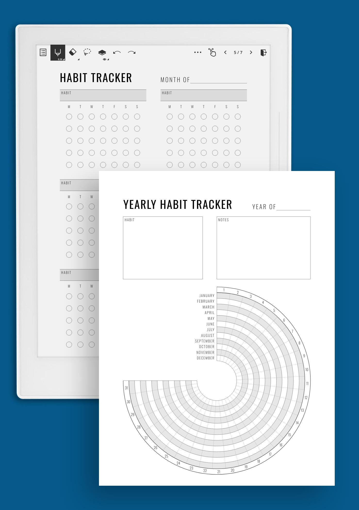

<div align="center">
  <a href="https://github.com/alexdrumi/webserv">
    
  </a>
</div>


# Habit Tracker CLI
A Habit Tracker CLI application built with Django that leverages OOP and design pattern principles to manage users, habits, goals, progress, and reminders.


<br>

## Table of Contents
* [General Info](#general-information)
* [Technologies Used](#technologies-used)
* [Features](#features)
* [Screenshots](#screenshots)
* [Setup](#setup)
* [Usage](#usage)


## General Information


Habit Tracker CLI is a command-line application designed to help users effectively monitor, track, and improve their daily habits. Built with Django as the backend framework, this project emphasizes a clean, scalable architecture through the use of Object-Oriented Design Patterns, including:

**Controller Pattern**: Manages user requests, delegating tasks to the Facade for simple operations and Orchestrator for complex workflows.<br>
**Factory Pattern**: Constructs domain-specific objects like GoalSubject, ensuring consistency and clean object creation.<br>
**Observer Pattern**: Reacts to state changes of habits for dynamic decision-making.<br>
**Facade Pattern**: Provides a simplified interface for routine operations, hiding subsystem complexity.<br>
**Orchestrator Pattern**: Coordinates complex, chained tasks involving validation, streak updating, and KVI management.<br>
**Singleton Pattern**: Ensures a single instance of key components, such as the database connection manager, to maintain consistency.<br>

The project allows you to:<br>

- Create, update, and delete user accounts.<br>
- Set up daily or weekly habits..<br>
- Define goals for each habit.
- Track progress with timestamps and streak calculations.
- Generate reminders and perform basic analytics.


The Habit Tracker CLI is designed with modularity, testability, and maintainability in mind, providing a solid foundation for future enhancements, including potential integration with machine learning analysis for user behavior insights.

<br>


## Technologies Used
- Python 3.8+ – Primary language for the CLI and business logic.
- Django – Backend framework for managing models and migrations.
- MySQL/MariaDB – Database engine.
- Click - For building the command-line interface.
- Pytest - Unit testing framework for all repositories/services.
  


## Features
- User Management: Create, update, delete, and validate users.
- Habit Management: Add and modify daily/weekly habits.
- Goal Setting: Define goals for each habit.
- Progress Tracking: Record progress entries with timestamps and compute streaks.
- Reminders & Analytics: Set up reminders and view habit analytics.
- CLI Interface: Interact with the application through a command-line interface.
- All interaction with MariaDB are via repositories, implemented with raw SQL queries.


## Screenshots


## Setup
Requirements are:
- Docker
- Python 3.8

### Installation
1. **Clone the repository:**
   ```bash
   git clone git@github.com:alexdrumi/habit_tracker.git
   cd habit_tracker

2. **Change the environment variable name. (optional: alter usernames, passwords etc):**
   ```bash
   mv .env_example .env  


2. **Build containers and packages:**
   ```bash
   make build
  
2. **Run containers:**
   ```bash
   make up
2. **Setup virtual environment:**
   ```bash
   make setup_env
2. **Migrate database:**
   ```bash
   make migrate_local
2. **Enter virtual environment:**
   ```bash
   source venv/bin/activate


## Usage
2. **Run the Habit Tracker CLI by executing the main function (inside virtualenv):**
   ```bash
   python main.py

2. **To seed the database with sample data, use:**
   ```bash
   python main.py --seed

2. **Run the test suite:**
   ```bash
   pytest apps/


## Media

**Demo GIFs:**

- **Training Process:**  
  
